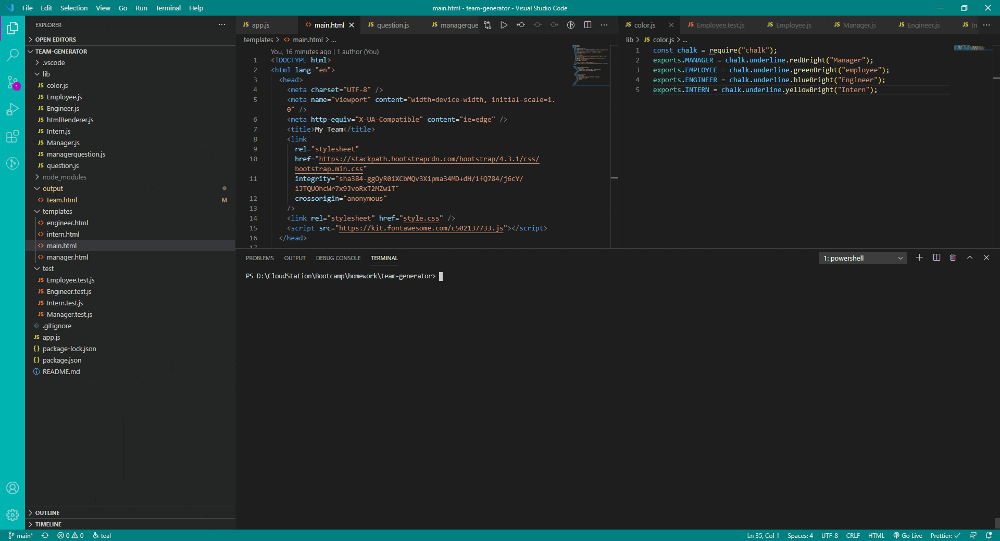

# Team-Generator

This project is a Team Generator. It allows you to create an HTML page with a Manager and multiple employees. THe Employees can be a mix of Engineers and Inters, with no limit.

# Installation

To use this app, run `npm install` to get all the dependencies.

After the installation, you can start the app with the following command:

```
node app.js
```

# Usage

Once you run `node app.js` you will first be promted to create the team's <span style="color:red">Manager</span> .

After this, you will be propmted to enter the <span style="color:green">Employees</span> . Here you will have to select the role for the employees.

The options are <span style="color:blue">Engineer</span> and <span style="color:yellow">Intern</span> .


